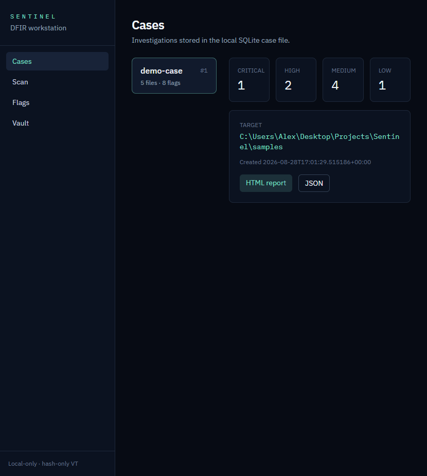
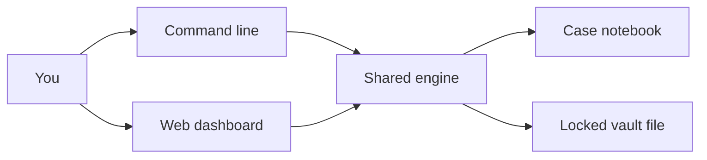
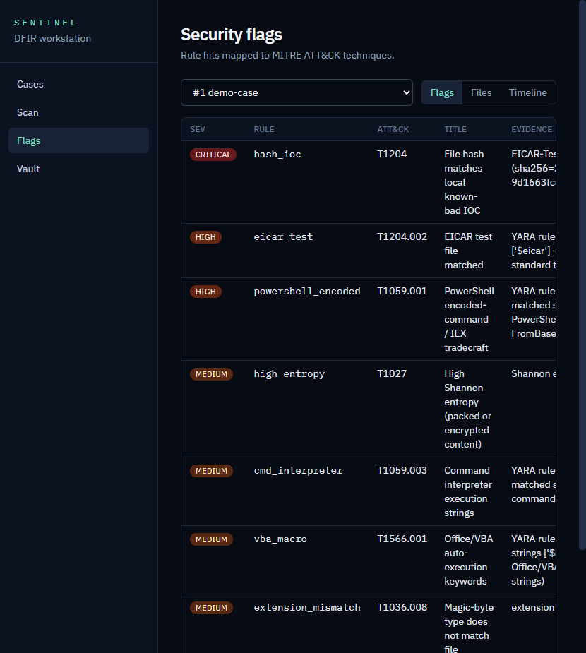
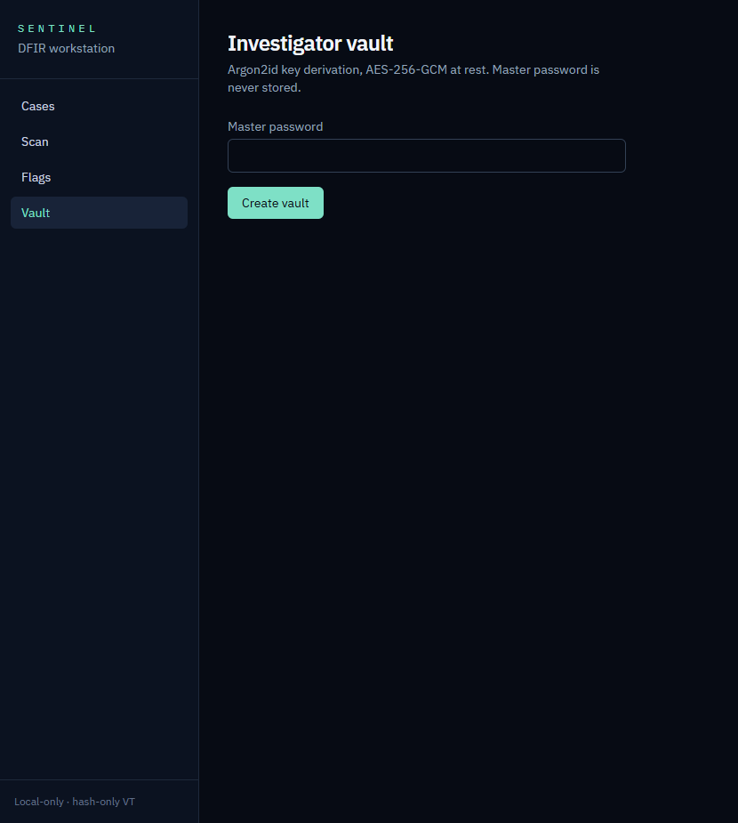

# Sentinel

A **local digital forensics workstation**. Point it at files on your machine: it fingerprints them, raises security warnings, and keeps investigation secrets in a locked vault. Use it from the command line or a web dashboard.

This is a **defensive / forensic** tool. It does not run malware, generate exploits, or upload file bytes to the internet. Optional VirusTotal lookups send **only a hash** (a fingerprint), never the file itself.

Demo samples in this repo are harmless on purpose (the EICAR antivirus test string, fake “lure” text, a mislabelled file, random-looking bytes).



---

## What it is, in plain English

Forensics here means *“what is this file, and should I worry?”* — not *“break into things.”*

You open a **case** (an investigation notebook), scan a folder, and Sentinel:

1. **Takes fingerprints** of every file (hashes) so you can say later “this is the same sample.”
2. **Looks closely** — wrong file extensions, packed/encrypted-looking data, suspicious strings, Windows program imports, YARA rule hits.
3. **Raises flags** with a severity and a MITRE ATT&CK label (a shared language for “what an attacker might be trying to do”).
4. **Writes a report** (HTML or JSON) you could hand someone.
5. **Stores secrets** (VirusTotal keys, case passwords, notes) in an encrypted vault — a locked drawer, not a sticky note.

Data stays on your machine under `~/.sentinel/` unless you opt into a hash-only VirusTotal lookup.

---

## How the system is designed

One workshop, two doors. The CLI and the web UI are not two products. They are two ways to talk to the **same engine**.



| Piece | What it is |
| --- | --- |
| **Engine** (`sentinel/`) | Walks folders, hashes files, matches rules, raises flags, encrypts the vault, writes reports |
| **CLI** (`sentinel_cli/`) | Same engine with a keyboard. Good for scripts and “I scanned this USB.” |
| **API + React UI** (`sentinel_api/`, `web/`) | Same engine with a screen. FastAPI is the receptionist; the dashboard is the SOC-style UI |
| **SQLite case file** | Notebook + evidence list: what you scanned, when, hashes, flags |
| **Vault file** | Separate encrypted file. Copying the case database does **not** give you the passwords |

Local-only is a design choice: a real analyst often works on a machine that should not phone home.

| Layer | Path |
| --- | --- |
| Core library | `sentinel/` |
| CLI | `sentinel_cli/` |
| HTTP API | `sentinel_api/` |
| Dashboard | `web/` |
| Bundled YARA + ATT&CK map | `sentinel/data/` |
| Extra YARA / hash lists | `rules/`, `intel/` |
| Demo fixtures | `samples/` |

---

## What the security features actually do

### File threat checking — fingerprints and a closer look

When you scan a folder, Sentinel does the digital equivalent of bagging evidence:

| Feature | In plain English |
| --- | --- |
| **Hashes** (MD5, SHA-1, SHA-256) | A fingerprint of the bytes. Rename the file and the fingerprint does not change. That is how you match a file to a known-bad list later. |
| **Magic bytes vs extension** | A `.png` that is actually text is like a jar labelled “jam” that contains pickles. Attackers rename malware to look harmless. |
| **Shannon entropy** | How “random” the bytes look. Normal text is patterned. Encrypted or packed data looks like static. High entropy is a **hint**, not proof. |
| **MAC timeline** | Modified / accessed / created timestamps — “this showed up, then this changed.” |
| **Strings / IOCs** | Readable scraps inside the file: URLs, IPs, `powershell`, `cmd.exe`, registry paths. *Indicators of compromise* = things that often show up in bad activity. |
| **PE extras** | Windows `.exe`/`.dll` files have an ingredients list (imports). Some imports are commonly used to inject code or download extra files. |
| **YARA** | Search rules: “if you see this EICAR test string, or PowerShell encoded-command language, flag it.” Like a metal detector with a list of shapes. Bundled rules plus a user `rules/` folder. |
| **Local hash list** | A phone book of known-bad fingerprints (`intel/known_bad.json`, plus a bundled EICAR entry). |
| **VirusTotal (optional)** | Ask “has the internet seen this fingerprint?” You send **only the hash**. API key can live in the vault as `virustotal`. |



### Security flags — “so what?”

Raw facts are not an investigation. The flag engine turns signals into findings: severity, evidence snippet, rule id, and **MITRE ATT&CK** technique IDs.

Examples from the demo samples:

- Hash on the known-bad list → **critical** (T1204 user execution)
- YARA hit for PowerShell encoding → **high** (T1059.001)
- High entropy → **medium** (T1027 obfuscation)
- Wrong extension → **medium** (T1036 masquerading)

**Composite rules** stack signals: a YARA hit *and* high entropy on the same file is more interesting than either alone.

Each scan is a **case** with a name, path, and evidence hashes — enough to talk about **chain of custody**: what you examined, its fingerprint, and when you looked.

Export a printable **HTML** report or **JSON**.

### Investigator vault — a locked drawer

This is a password manager for the *analyst* (VirusTotal keys, case passwords, notes), not a consumer Bitwarden clone.



The important part is **real cryptography**, not “encode it and hope”:

1. **Master password** — only in your head (and briefly in memory while unlocked). Never stored in the vault file.
2. **Argon2id** — a slow, memory-hard recipe that turns the password into a key. Slow is the point: guessing millions of passwords becomes expensive.
3. **AES-256-GCM** — hides the contents *and* detects tampering. Wrong password → decrypt fails. Edited ciphertext → decrypt fails.

Encoding (Base64) is not encryption. A key-derivation function plus authenticated encryption is.

| Goal | How Sentinel does it |
| --- | --- |
| Slow offline guessing | Argon2id (memory-hard KDF) |
| Confidentiality + integrity | AES-256-GCM (AEAD); wrong password fails closed |
| Master password not stored | Only salt + ciphertext on disk |
| Backup is still encrypted | Copy of `vault.bin` after password verification |
| UI session | In-memory key, auto-lock (`SENTINEL_VAULT_LOCK_SECONDS`, default 300s) |

This is **not** a multi-user cloud password manager. If the OS user is compromised while the vault is unlocked, secrets are in process memory — the same class of limitation as other local vaults.

---

## Quick start

Python 3.12+ (3.13 is fine).

```bash
python -m venv .venv
# Windows
.venv\Scripts\activate
pip install -e ".[dev]"

sentinel scan samples --case demo
sentinel cases
sentinel flags 1
sentinel report 1 --format html -o report.html
```

### Web dashboard

```bash
# Terminal 1 — API (serves web/dist if you have built it)
sentinel web

# Terminal 2 — UI with hot reload
cd web
npm install
npm run dev
```

- Dev UI: [http://127.0.0.1:5173](http://127.0.0.1:5173)
- After `npm run build`, `sentinel web` also serves the UI on [http://127.0.0.1:8000](http://127.0.0.1:8000)

### Vault

```bash
sentinel vault init
sentinel vault add --name virustotal --type api_key
sentinel vault generate --length 24
sentinel vault backup vault-backup.bin
```

Optional: `VIRUSTOTAL_API_KEY` in the environment, or store the key in the vault. From the UI: **Flags → files → hash lookup**. See `.env.example`. Override the data directory with `SENTINEL_HOME`.

---

## Tests

```bash
pytest
```

Coverage includes official EICAR hash stability, a known YARA hit, vault round-trip (wrong password must fail), and scan → flags → report.

---

## Responsible use

- Scan only systems and files you are authorized to examine.
- Do not add live malware to this repo. `samples/` is benign by design.
- EICAR is the industry-standard AV test string; some endpoint products may alert on `samples/eicar.com.txt`.
- YARA hits and entropy flags are **leads**, not proof of malice.

## License

MIT
